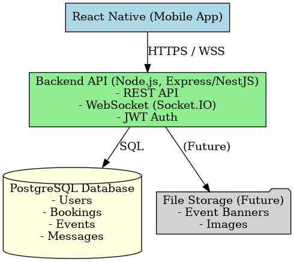
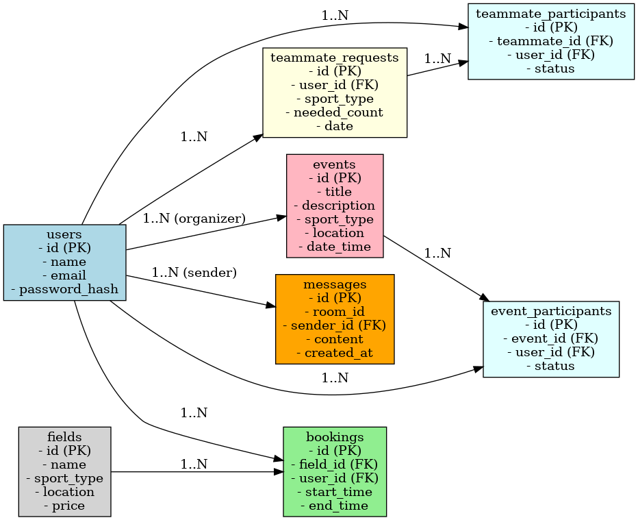

# SportMate MVP - Product Requirements Document (PRD)

**Version:** 1.0
**Date:** 2025-09-07
**Owner:** \Rizky Juniastiar

---

## 1. 🎯 Product Overview

**Purpose:**
SportMate is a social sports platform that allows users to book sports fields, find teammates or sparring partners, chat in real-time, and browse/join sports events.
**Vision:**
To become the easiest way for people to connect, play, and enjoy sports together.

---

## 2. 👥 Target Users

1. Casual players – want to play but lack teammates.
2. Field owners/managers – want to manage bookings and promote their fields.
3. Sports enthusiasts – want to discover and join events.

---

## 3. 📱 MVP Features

### 3.1 Field Booking

* Browse fields by sport, location, date, time.
* View field availability.
* Reserve/book a field.
* Booking history.

### 3.2 Find Teammates / Sparring Mate

* Post teammate requests.
* Browse/join requests.
* Approve/reject requests.

### 3.3 Chat

* Simple 1-on-1 chat.
* Chats linked to booking or teammate request.
* Real-time via WebSocket (Socket.IO).

### 3.4 Events

* Browse sports events.
* Join/leave events.
* View joined events in profile.

---

## 4. 🚀 Future Features (Post-MVP)

* Online payments & split bill.
* Ratings & reviews for players and fields.
* Group chats & team management.
* Push notifications.
* Gamification (loyalty points, badges).
* AI-powered teammate matching.

---

## 5. 🖼 User Flows

**Booking:** Browse → Select field → Pick slot → Confirm → Success.
**Teammate:** Create post → Others browse → Join → Approval → Chat.
**Event:** Browse → View detail → Join → See in “My Events”.
**Chat:** User finds teammate/event → Open chat → Exchange messages.

---

## 6. 📋 Functional Requirements

### 6.1 Authentication

* Register with email & password.
* Login with email & password.
* JWT-based authentication.
* Passwords hashed with bcrypt.

### 6.2 Booking

* Field listing with details (location, price, availability).
* Booking creation and cancellation.

### 6.3 Teammates

* Post teammate request.
* Join request.
* Approve/reject participants.

### 6.4 Events

* List of events.
* Join/leave event.

### 6.5 Chat

* Real-time 1-on-1 messaging (WebSocket).
* Text messages only.
* Messages persisted in database.

---

## 7. 🎨 Design & UX

* Bottom navigation bar with: Home, Teammates, Events, Chat.
* Simple clean UI, sporty color scheme (green/blue/orange).

---

## 8. ⚙️ Technical Requirements

* Frontend: React Native
* Backend: Node.js (TypeScript, Express or NestJS)
* Database: PostgreSQL
* Auth: JWT, bcrypt password hashing
* Chat: WebSocket (Socket.IO)
* Hosting: Cloud (AWS/GCP/Azure)

---

## 9. ✅ Success Metrics

* Number of successful field bookings.
* Number of teammate requests created/joined.
* Number of chats/messages exchanged.
* Number of events joined.

---

## 10. 🛑 Out of Scope (MVP)

* Payments.
* Push notifications.
* Group/team features.
* Ratings & reviews.

---

## 11. 📨 Chat Module (WebSocket)

**Endpoint:** `wss://api.sportmate.com/chat`
**Auth:** JWT token in query parameter.

**Events:**

* `join_room` → join chat room: `{ "roomId": "booking_123" }`
* `send_message` → send message: `{ "roomId": "booking_123", "message": "Let's meet at 7pm" }`
* `message` → broadcasted from server: `{ "roomId": "booking_123", "senderId": "user_456", "message": "Let's meet at 7pm", "timestamp": "2025-09-07T10:15:00Z" }`
* `user_joined` / `user_left` → notify room members.

**Message Persistence:** REST endpoint to fetch history: `GET /chat/rooms/:id/messages`

---

## 12. 🏗️ Architecture Diagram



---

## 13. 🗄️ Database Schema (ERD)



**Tables:**

* `users`, `fields`, `bookings`, `teammate_requests`, `events`, `messages`, `event_participants`, `teammate_participants`

---

## 14. README.md (Developer Setup)

```markdown
# SportMate (MVP)

## Tech Stack
- Frontend: React Native
- Backend: Node.js (TypeScript, Express/NestJS)
- Database: PostgreSQL
- Auth: JWT, bcrypt
- Chat: WebSocket (Socket.IO)

## Setup
### Backend
1. `cd backend`
2. `cp .env.example .env`
3. `npm install`
4. `npm run dev`

### Database
1. `createdb sportmate`
2. Run migrations: `npm run migrate`

### Frontend
1. `cd frontend`
2. `npm install`
3. `npm run start`

### Run
- Android: `npm run android`
- iOS: `npm run ios`

## API Endpoints
- Auth: `POST /auth/register`, `POST /auth/login`
- Fields: `GET /fields`, `POST /bookings`, `GET /bookings/me`
- Teammates: `POST /teammates`, `GET /teammates`, `POST /teammates/:id/join`
- Events: `GET /events`, `POST /events/:id/join`
- Chat: WebSocket `/chat`
```
